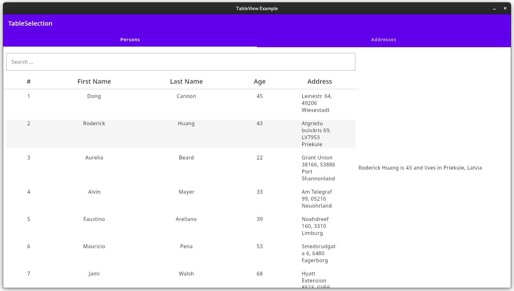

# compose-tableView

Example application with a desktop table view for Compose. The app contains 
two tables: Persons and Addresses. Both have the same functional elements, 
so we keep their introduction brief.

## Preparing the data model

The `TableView` uses reflection to determine the information to be displayed 
in the table. So, you have to annotate all relevant fields in the 
corresponding class as `@TableHeader`:

```kotlin
data class Person(
    @TableHeader("First Name", 0)
    val firstName: String,
    @TableHeader("Last Name", 1)
    val lastName: String,
    @TableHeader("Age", 2)
    val age: Int,
    @TableHeader("Address", 3)
    val address: Address?
)
```

The annotation requires 2 arguments: The heading of the column to be 
displayed in the dialog and an index. The latter is used to sort the table 
headers from left to right.

## The `TableView` itself



The composable `TableView` takes a couple of arguments:

```kotlin
@Composable
inline fun <reified T : Any> TableView(
    content: MutableState<List<T>>, // contains all elements to be displayed
    indexColumn: Boolean = false, // simple numbering of the table rows
    indexColWidth: Dp = 30.dp, // to adjust the index column's width
    noinline onRowSelection: (T) -> Unit // execute when selecting a row
) {
    // ...
}
```

Each column of the table can be used to sort the entries descending or 
ascending by clicking the column header. **Note that selecting a column for 
sorting the last sorting criterion is reset!**

The search line above the table will filter the table on input by searching 
for a match in all columns.

## How to embed in your application

This codes is derived from `TabView.kt`. 

```kotlin
@Composable
fun TableBody(tableState: MutableState<SelectionState>) {

    val person: MutableState<Person?> = remember { mutableStateOf(null) }
    val address: MutableState<Address?> = remember { mutableStateOf(null) }

    val onPersonSelect: (Person) -> Unit = {
        person.value = it
    }

    val onAddressSelect: (Address) -> Unit = {
        address.value = it
    }

    Row {
        Column(Modifier.fillMaxWidth(0.7f)) {
            when (tableState.value) {
                // TableView with index column
                SelectionState.PERSONS -> TableView(
                    mutableStateOf(persons),
                    true,
                    onRowSelection = onPersonSelect
                )

                // TableView without index column
                SelectionState.ADDRESSES -> TableView(
                    mutableStateOf(addresses),
                    onRowSelection = onAddressSelect
                )
            }
        }
        // ...
    }
}
```
